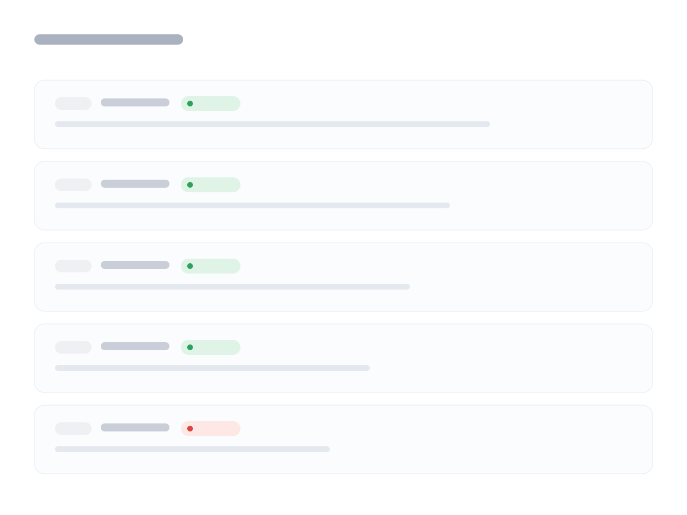
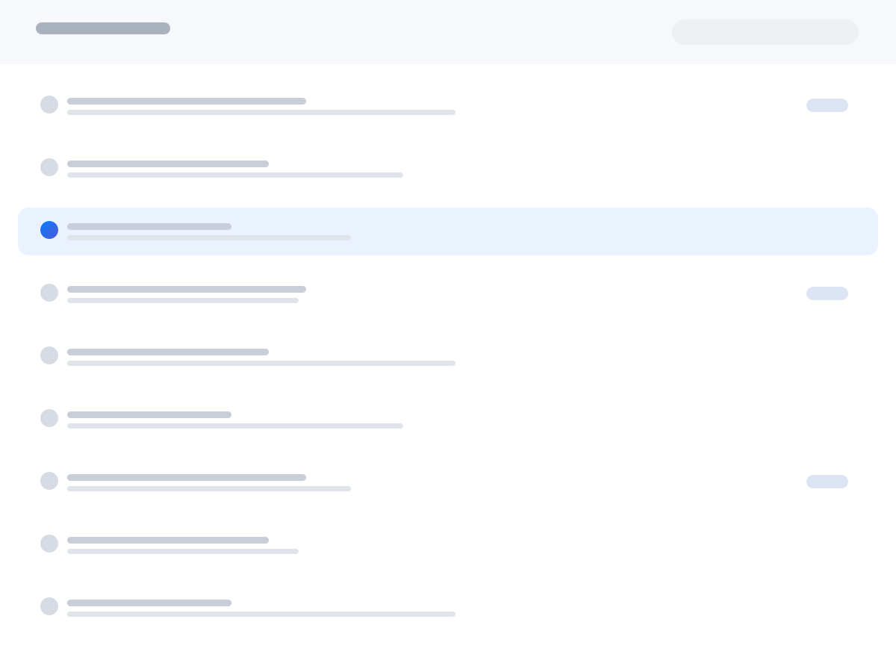

# Marketing — landing pages: hero, chapters, figures, bento, site footer

Source: https://ui.barua.tz/docs/marketing.html
Rules and conventions: https://ui.barua.tz/llms.txt

## Marketing Nav

Quieter than an application’s chrome: a slim sticky bar in the chrome material, links centred, one action at the end. It is .b-marketing-nav rather than .b-topnav because a product page is not an app and should not pretend to be.

- Documentation: https://ui.barua.tz/docs/marketing.html#marketing-nav
- Classes: `b-btn` `b-btn--primary` `b-btn--sm` `b-marketing-nav` `b-marketing-nav__brand` `b-marketing-nav__links`

```html
<nav class="b-marketing-nav" style="position: static">
  <a class="b-marketing-nav__brand" href="#marketing-nav">Barua</a>
  <div class="b-marketing-nav__links"><a href="#marketing-nav">Mail</a><a href="#marketing-nav">Domains</a><a href="#marketing-nav">Pricing</a></div>
  <a class="b-btn b-btn--primary b-btn--sm" href="#marketing-nav">Get started</a>
</nav>
```

```tsx
import { ButtonLink, MarketingNav, MarketingNavBrand, MarketingNavLinks } from "barua-ui";

<MarketingNav style={{ position: "static" }}>
  <MarketingNavBrand href="#marketing-nav">Barua</MarketingNavBrand>
  <MarketingNavLinks>
    <a href="#marketing-nav">Mail</a>
    <a href="#marketing-nav">Domains</a>
    <a href="#marketing-nav">Pricing</a>
  </MarketingNavLinks>
  <ButtonLink variant="primary" size="sm" href="#marketing-nav">Get started</ButtonLink>
</MarketingNav>
```

## Chapter

One idea, centred, with room around it. An eyebrow names the subject, the title is capped at twenty characters of measure so it always breaks well, and the lede is one sentence at reading width. .b-chapter--tight halves the vertical room; .b-chapter--start aligns the whole chapter to the reading edge.

- Documentation: https://ui.barua.tz/docs/marketing.html#chapter
- Classes: `b-btn` `b-btn--lg` `b-btn--primary` `b-chapter` `b-chapter--tight` `b-chapter__actions` `b-chapter__eyebrow` `b-chapter__lede` `b-chapter__title` `b-link`

```html
<div class="b-chapter b-chapter--tight">
  <p class="b-chapter__eyebrow">Barua Mail</p>
  <h2 class="b-chapter__title">Your business, on your own name.</h2>
  <p class="b-chapter__lede">Professional email on the domain you own — set up in an afternoon, paid for in shillings.</p>
  <div class="b-chapter__actions">
    <a class="b-btn b-btn--primary b-btn--lg" href="#chapter">Start free trial</a>
    <a class="b-link" href="#chapter">See how it works &rsaquo;</a>
  </div>
</div>
```

```tsx
import { ButtonLink, Chapter, Link } from "barua-ui";

<Chapter tight>
  <p className="b-chapter__eyebrow">Barua Mail</p>
  <h2 className="b-chapter__title">Your business, on your own name.</h2>
  <p className="b-chapter__lede">Professional email on the domain you own — set up in an afternoon, paid for in shillings.</p>
  <div className="b-chapter__actions">
    <ButtonLink variant="primary" size="lg" href="#chapter">Start free trial</ButtonLink>
    <Link href="#chapter">See how it works ›</Link>
  </div>
</Chapter>
```

## Figure

A picture is furniture, so it has a shape: .b-figure__frame clips it to the large radius, lifts it on the elevation scale, and fills any gap with a surface rather than white. .b-figure--bleed lets it run to the edges of the page, which is how a chapter ends when the image is the argument.

- Documentation: https://ui.barua.tz/docs/marketing.html#figure
- Classes: `b-figure` `b-figure__caption` `b-figure__frame`

```html
<figure class="b-figure" style="max-width: 26rem">
  <div class="b-figure__frame">
    
  </div>
  <figcaption class="b-figure__caption">Every record checked against public resolvers.</figcaption>
</figure>
```

```tsx
import { Figure } from "barua-ui";

<Figure style={{ maxWidth: "26rem" }}>
  <div className="b-figure__frame">
    
  </div>
  <figcaption className="b-figure__caption">Every record checked against public resolvers.</figcaption>
</Figure>
```

## Feature Row

Picture beside prose, alternating down the page. .b-feature-row--flip swaps the sides so consecutive rows do not march; below md both stack with the picture first. Actions inside a row align with the prose, never centre.

- Documentation: https://ui.barua.tz/docs/marketing.html#feature-row
- Classes: `b-chapter__actions` `b-chapter__eyebrow` `b-feature-row` `b-feature-row__body` `b-feature-row__title` `b-figure` `b-figure__frame` `b-link`

```html
<div class="b-feature-row">
  <figure class="b-figure">
    <div class="b-figure__frame">
      
    </div>
  </figure>
  <div>
    <p class="b-chapter__eyebrow">Mail</p>
    <h3 class="b-feature-row__title">An inbox that behaves like an application.</h3>
    <p class="b-feature-row__body">Threads, labels, and search that reads the whole message — one keystroke away.</p>
    <p class="b-chapter__actions"><a class="b-link" href="#feature-row">Open an inbox &rsaquo;</a></p>
  </div>
</div>
```

```tsx
import { FeatureRow, Figure, Link } from "barua-ui";

<FeatureRow>
  <Figure>
    <div className="b-figure__frame">
      
    </div>
  </Figure>
  <div>
    <p className="b-chapter__eyebrow">Mail</p>
    <h3 className="b-feature-row__title">An inbox that behaves like an application.</h3>
    <p className="b-feature-row__body">Threads, labels, and search that reads the whole message — one keystroke away.</p>
    <p className="b-chapter__actions">
      <Link href="#feature-row">Open an inbox ›</Link>
    </p>
  </div>
</FeatureRow>
```

## Bento

Tiles of unequal weight in one grid — the rest of a platform at a glance. .b-bento__tile--wide takes two columns so the grid has a rhythm instead of a checkerboard; on a phone every tile is full width.

- Documentation: https://ui.barua.tz/docs/marketing.html#bento
- Classes: `b-bento` `b-bento__body` `b-bento__tile` `b-bento__tile--wide` `b-bento__title` `b-icon-tile` `b-icon-tile--sm` `b-icon-tile--solid` `b-icon-tile--teal`

```html
<div class="b-bento">
  <article class="b-bento__tile b-bento__tile--wide">
    <span class="b-icon-tile b-icon-tile--solid" aria-hidden="true"><svg viewBox="0 0 20 20" fill="none"><rect x="3" y="4.5" width="14" height="11" rx="2" stroke="currentColor" stroke-width="1.5"/><path d="m4.5 7 5.5 4 5.5-4" stroke="currentColor" stroke-width="1.5" stroke-linecap="round" stroke-linejoin="round"/></svg></span>
    <h3 class="b-bento__title">Mail</h3>
    <p class="b-bento__body">Mailboxes on your domain, shared inboxes for the team, and IMAP for the app you already use.</p>
  </article>
  <article class="b-bento__tile">
    <span class="b-icon-tile b-icon-tile--sm b-icon-tile--teal" aria-hidden="true"><svg viewBox="0 0 20 20" fill="none"><path d="M3.5 5.5A1.5 1.5 0 0 1 5 4h3l1.5 2H15a1.5 1.5 0 0 1 1.5 1.5V14a1.5 1.5 0 0 1-1.5 1.5H5A1.5 1.5 0 0 1 3.5 14V5.5Z" stroke="currentColor" stroke-width="1.5" stroke-linejoin="round"/></svg></span>
    <h3 class="b-bento__title">Storage</h3>
    <p class="b-bento__body">Files beside the mailbox they belong to.</p>
  </article>
</div>
```

```tsx
import { Bento, IconTile } from "barua-ui";

<Bento>
  <article className="b-bento__tile b-bento__tile--wide">
    <IconTile className="b-icon-tile--solid" aria-hidden="true">
      <svg viewBox="0 0 20 20" fill="none">
        <rect x="3" y="4.5" width="14" height="11" rx="2" stroke="currentColor" strokeWidth="1.5" />
        <path d="m4.5 7 5.5 4 5.5-4" stroke="currentColor" strokeWidth="1.5" strokeLinecap="round" strokeLinejoin="round" />
      </svg>
    </IconTile>
    <h3 className="b-bento__title">Mail</h3>
    <p className="b-bento__body">Mailboxes on your domain, shared inboxes for the team, and IMAP for the app you already use.</p>
  </article>
  <article className="b-bento__tile">
    <IconTile className="b-icon-tile--sm b-icon-tile--teal" aria-hidden="true">
      <svg viewBox="0 0 20 20" fill="none">
        <path d="M3.5 5.5A1.5 1.5 0 0 1 5 4h3l1.5 2H15a1.5 1.5 0 0 1 1.5 1.5V14a1.5 1.5 0 0 1-1.5 1.5H5A1.5 1.5 0 0 1 3.5 14V5.5Z" stroke="currentColor" strokeWidth="1.5" strokeLinejoin="round" />
      </svg>
    </IconTile>
    <h3 className="b-bento__title">Storage</h3>
    <p className="b-bento__body">Files beside the mailbox they belong to.</p>
  </article>
</Bento>
```

## Spec Strip

Four numbers, evenly spaced, with the claim underneath each. Use tabular numerals so the row stays even, and keep the labels honest — a figure with a footnote is worth more than a figure without one.

- Documentation: https://ui.barua.tz/docs/marketing.html#spec-strip
- Classes: `b-spec-strip` `b-spec__label` `b-spec__value` `b-tabular-nums`

```html
<div class="b-spec-strip">
  <div><span class="b-spec__value b-tabular-nums">10 min</span><span class="b-spec__label">From signup to first email</span></div>
  <div><span class="b-spec__value b-tabular-nums">99.9%</span><span class="b-spec__label">Delivery to the major providers</span></div>
  <div><span class="b-spec__value">TZS</span><span class="b-spec__label">Billed in shillings</span></div>
</div>
```

```tsx
import { CountUp, SpecStrip } from "barua-ui";

<SpecStrip>
  <div>
    <CountUp className="b-spec__value">10 min</CountUp>
    <span className="b-spec__label">From signup to first email</span>
  </div>
  <div>
    <CountUp className="b-spec__value">99.9%</CountUp>
    <span className="b-spec__label">Delivery to the major providers</span>
  </div>
  <div>
    <span className="b-spec__value">TZS</span>
    <span className="b-spec__label">Billed in shillings</span>
  </div>
</SpecStrip>
```

## Dark chapter

Product pages alternate light and dark full-bleed sections so the page has chapters you can feel while scrolling. .b-chapter--dark flips color-scheme rather than hardcoding colours, so every token inside resolves for the dark ground and any component dropped in keeps working.

- Documentation: https://ui.barua.tz/docs/marketing.html#dark-chapter
- Classes: `b-chapter` `b-chapter--dark` `b-chapter--tight` `b-chapter__eyebrow` `b-chapter__lede` `b-chapter__title`

```html
<div class="b-chapter b-chapter--dark b-chapter--tight" style="border-radius: var(--b-radius-xl)">
  <p class="b-chapter__eyebrow">Barua for business</p>
  <h2 class="b-chapter__title">Work that arrives.</h2>
  <p class="b-chapter__lede">The same chapter, on the other ground.</p>
</div>
```

```tsx
import { Chapter } from "barua-ui";

<Chapter dark tight style={{ borderRadius: "var(--b-radius-xl)" }}>
  <p className="b-chapter__eyebrow">Barua for business</p>
  <h2 className="b-chapter__title">Work that arrives.</h2>
  <p className="b-chapter__lede">The same chapter, on the other ground.</p>
</Chapter>
```

## Pill switcher

One product across several surfaces, switched from a row of pills under the bar — .b-pill-nav , with .is-active on the current one. Use it when the surfaces are peers; use tabs when one contains the others.

- Documentation: https://ui.barua.tz/docs/marketing.html#pill-nav
- Classes: `b-pill-nav`

```html
<nav class="b-pill-nav" aria-label="Surfaces">
  <a class="is-active" href="#pill-nav">Mail</a><a href="#pill-nav">Storage</a><a href="#pill-nav">Teams</a><a href="#pill-nav">Domains</a>
</nav>
```

```tsx
import { PillNav } from "barua-ui";

<PillNav aria-label="Surfaces">
  <a className="is-active" href="#pill-nav">Mail</a>
  <a href="#pill-nav">Storage</a>
  <a href="#pill-nav">Teams</a>
  <a href="#pill-nav">Domains</a>
</PillNav>
```

## Card rail

A row you push sideways, snapping card to card — for a set of features that reads better as a sequence than a grid. Every figure in a rail is forced to one aspect so the captions line up; photographs arrive at whatever shape they were taken.

- Documentation: https://ui.barua.tz/docs/marketing.html#card-rail
- Classes: `b-card-rail` `b-figure` `b-figure__frame` `b-rail-card__body` `b-rail-card__text` `b-rail-card__title`

```html
<div class="b-card-rail">
  <article>
    <figure class="b-figure"><div class="b-figure__frame"></div></figure>
    <div class="b-rail-card__body">
      <div class="b-rail-card__title">Shared mailboxes</div>
      <p class="b-rail-card__text">sales@ and support@ belong to the team.</p>
    </div>
  </article>
  <article>
    <figure class="b-figure"><div class="b-figure__frame"></div></figure>
    <div class="b-rail-card__body">
      <div class="b-rail-card__title">Files where the mail is</div>
      <p class="b-rail-card__text">Storage sits beside the mailbox.</p>
    </div>
  </article>
  <article>
    <figure class="b-figure"><div class="b-figure__frame"></div></figure>
    <div class="b-rail-card__body">
      <div class="b-rail-card__title">Paid in shillings</div>
      <p class="b-rail-card__text">Mobile money or card, one balance.</p>
    </div>
  </article>
</div>
```

```tsx
import { CardRail, Figure } from "barua-ui";

<CardRail>
  <article>
    <Figure>
      <div className="b-figure__frame">
        
      </div>
    </Figure>
    <div className="b-rail-card__body">
      <div className="b-rail-card__title">Shared mailboxes</div>
      <p className="b-rail-card__text">sales@ and support@ belong to the team.</p>
    </div>
  </article>
  <article>
    <Figure>
      <div className="b-figure__frame">
        
      </div>
    </Figure>
    <div className="b-rail-card__body">
      <div className="b-rail-card__title">Files where the mail is</div>
      <p className="b-rail-card__text">Storage sits beside the mailbox.</p>
    </div>
  </article>
  <article>
    <Figure>
      <div className="b-figure__frame">
        
      </div>
    </Figure>
    <div className="b-rail-card__body">
      <div className="b-rail-card__title">Paid in shillings</div>
      <p className="b-rail-card__text">Mobile money or card, one balance.</p>
    </div>
  </article>
</CardRail>
```

## Moving media

A hero can move. Put a <video> in the figure frame with autoplay muted loop playsinline — muted because a page that makes noise is a page people close, and playsinline so phones do not take it fullscreen. Keep it short, keep it small, and give it a poster so something is there before it loads.

- Documentation: https://ui.barua.tz/docs/marketing.html#moving-media
- Classes: `b-figure` `b-figure__caption` `b-figure__frame`

```html
<figure class="b-figure" style="max-width: 30rem">
  <div class="b-figure__frame">
    <video src="../examples/assets/media/typing.mp4" autoplay muted loop playsinline preload="metadata" aria-label="Someone typing at a desk"></video>
  </div>
  <figcaption class="b-figure__caption">Ten seconds on loop, under a megabyte.</figcaption>
</figure>
```

```tsx
import { Figure } from "barua-ui";

<Figure style={{ maxWidth: "30rem" }}>
  <div className="b-figure__frame">
    <video
      src="../examples/assets/media/typing.mp4"
      autoplay
      muted
      loop
      playsInline
      preload="metadata"
      aria-label="Someone typing at a desk"
    ></video>
  </div>
  <figcaption className="b-figure__caption">Ten seconds on loop, under a megabyte.</figcaption>
</Figure>
```

## Promo band

One offer, full width, in its own colour — the band near the end of a product page that carries the ask. It sets a dark scheme so the controls inside it come out right.

- Documentation: https://ui.barua.tz/docs/marketing.html#promo-band
- Classes: `b-btn` `b-btn--glass` `b-btn--lg` `b-chapter__actions` `b-promo-band` `b-promo-band__body` `b-promo-band__title`

## Footnotes

The small print a claim earns. Numbered, caption-sized and tertiary, sitting between the last chapter and the footer — with <sup> markers on the claims themselves. A figure with a footnote is worth more than a figure without one.

- Documentation: https://ui.barua.tz/docs/marketing.html#footnotes
- Classes: `b-footnotes`

```html
<div class="b-footnotes" style="padding-block-start: 0">
  <ol>
    <li>Measured from account creation to first delivered message on a domain with working nameservers.</li>
    <li>Delivery to Gmail, Outlook and Yahoo across the last ninety days.</li>
  </ol>
</div>
```

```tsx
import { Footnotes } from "barua-ui";

<Footnotes style={{ paddingBlockStart: "0" }}>
  <ol>
    <li>Measured from account creation to first delivered message on a domain with working nameservers.</li>
    <li>Delivery to Gmail, Outlook and Yahoo across the last ninety days.</li>
  </ol>
</Footnotes>
```

## Site Footer

Small, dense, and unafraid of links: groups of destinations in columns, then the legal line that carries the footnotes the page made. Caption-sized throughout — a footer is for finding, not for reading.

- Documentation: https://ui.barua.tz/docs/marketing.html#site-footer
- Classes: `b-site-footer` `b-site-footer__group` `b-site-footer__groups` `b-site-footer__heading` `b-site-footer__legal`

```html
<footer class="b-site-footer" style="border-radius: var(--b-radius-lg)">
  <div class="b-site-footer__groups">
    <div class="b-site-footer__group">
      <div class="b-site-footer__heading">Barua</div>
      <a href="#site-footer">Mail</a><a href="#site-footer">Domains</a><a href="#site-footer">Pricing</a>
    </div>
    <div class="b-site-footer__group">
      <div class="b-site-footer__heading">Support</div>
      <a href="#site-footer">Help centre</a><a href="#site-footer">Status</a><a href="#site-footer">Contact</a>
    </div>
    <div class="b-site-footer__group">
      <div class="b-site-footer__heading">Company</div>
      <a href="#site-footer">About</a><a href="#site-footer">Privacy</a><a href="#site-footer">Terms</a>
    </div>
  </div>
  <p class="b-site-footer__legal">Prices include VAT where it applies.<br>Copyright &copy; 2026 Barua. Dar es Salaam, Tanzania.</p>
</footer>
```

```tsx
import { SiteFooter, SiteFooterGroup, SiteFooterGroups, SiteFooterHeading, SiteFooterLegal } from "barua-ui";

<SiteFooter style={{ borderRadius: "var(--b-radius-lg)" }}>
  <SiteFooterGroups>
    <SiteFooterGroup>
      <SiteFooterHeading>Barua</SiteFooterHeading>
      <a href="#site-footer">Mail</a>
      <a href="#site-footer">Domains</a>
      <a href="#site-footer">Pricing</a>
    </SiteFooterGroup>
    <SiteFooterGroup>
      <SiteFooterHeading>Support</SiteFooterHeading>
      <a href="#site-footer">Help centre</a>
      <a href="#site-footer">Status</a>
      <a href="#site-footer">Contact</a>
    </SiteFooterGroup>
    <SiteFooterGroup>
      <SiteFooterHeading>Company</SiteFooterHeading>
      <a href="#site-footer">About</a>
      <a href="#site-footer">Privacy</a>
      <a href="#site-footer">Terms</a>
    </SiteFooterGroup>
  </SiteFooterGroups>
  <SiteFooterLegal>
    Prices include VAT where it applies.
    <br />
    Copyright © 2026 Barua. Dar es Salaam, Tanzania.
  </SiteFooterLegal>
</SiteFooter>
```

